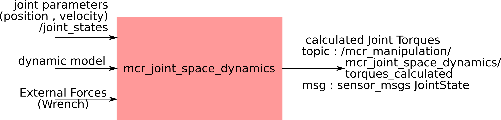

mcr_joint_space_dynamics
============

Joint space Dynamics calculates the torques for the joints, given the motion of
the joints (q, qdot, qdotdot), external forces on the segments, and the
dynamical parameters of the segments.

The joints parameters are taken by subscribing to /joint_states topic.
The external forces is provided by the user.
The dynamical parameters are made available by robot_description and the chain
created by it.

