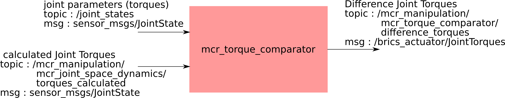

mcr_torque_comparator
============
Torque comparator compares the difference between the measured torque provided
by the controller and the calculated torque from the model.

The joints torques are taken by subscribing to /joint_states topic
The calculated torque is made available by the mcr_joint_space_dynamics nodelet
in the topic /torque_calculated

