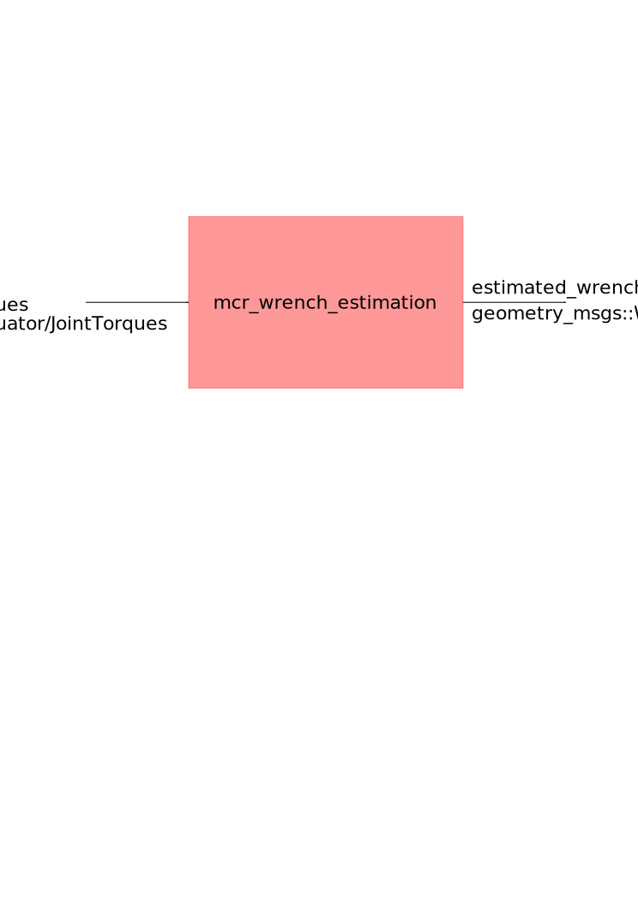

mcr_wrench_estimation
============

Wrench Estimation calculates the wrench (force + torque) acting on the
endfactor, given the torques acting on the joints and the 
dynamical parameters of the segments.

The joints torques are taken by subscribing to /arm_1/arm_controller/torques_command
The dynamical parameters are made available by robot_description and the chain
created by it.

